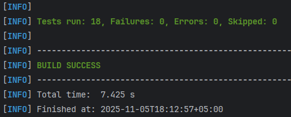

# EduPlatform - Система управления онлайн-обучением
### Архитектурные слои:
- **Controllers** - REST API endpoints
- **Services** - Бизнес-логика приложения (транзакции)
- **Repositories** - Доступ к данным (Spring Data JPA)
- **Entities** - Модели данных (JPA сущности + валидация)
- **Exceptions** - Обработка ошибок
- **Resources** - Конфигурация и миграции БД

#### Используемые переменные окружения:
```shell
# Настройки БД:
DB_HOST=localhost           # Хост БД (по умолчанию: localhost)
DB_PORT=5432               # Порт БД (по умолчанию: 5432)  
DB_NAME=edu_db             # Имя БД (по умолчанию: edu_db)
DB_USERNAME=postgres       # Пользователь БД (по умолчанию: postgres)
DB_PASSWORD=password       # Пароль БД (по умолчанию: postgres)

# Приложение:
SERVER_PORT=80             # Порт приложения (по умолчанию: 80)
SPRING_PROFILES_ACTIVE=dev # Активный профиль (по умолчанию: dev)

# Логирование и отладка:
SHOW_SQL=true              # Показывать SQL в логах (по умолчанию: true)
HIBERNATE_SQL_LOGGING=true # Логирование Hibernate SQL (по умолчанию: true)
DDL_AUTO=validate          # Стратегия DDL Hibernate (по умолчанию: validate)
FLYWAY_ENABLED=true        # Включить миграции Flyway (по умолчанию: true)
```

## Maven профили и команды для сборки

### Профили:

- test - для тестов (H2 база)
- prod - для продакшена (PostgreSQL)
- dev - для разработки (PostgreSQL)
### 1. Cборка:

* ПРОДАКШН
    ```shell
    mvn clean install -P prod -DskipTests          # прод сборка без тестов
    mvn clean install -P prod                      # прод сборка с тестами
    ```
* ТЕСТОВАЯ
    ```shell
    mvn clean install -P test -DskipTests          # тест сборка без тестов
    mvn clean install -P test                      # тест сборка с тестами
    ```
* РАЗРАБОТКА
    ```shell
    mvn clean install -DskipTests                  # дефолтная сборка без тестов  
    mvn clean install                              # дефолтная сборка с тестами
    ```
* ТОЛЬКО ТЕСТЫ
    ```shell 
    mvn test -P test          # unit + интеграционные тесты (test профиль)
    mvn test                  # unit + интеграционные тесты (dev профиль)
    ```
* БЫСТРАЯ СБОРКА (полное отключение тестов)
    ```shell
    mvn clean install -P prod "-Dmaven.test.skip=true"  # для PowerShell
    # или
    mvn clean install -P prod -Dmaven.test.skip=true    # для Bash
    ```
### Результат тестов:

### Развернуть ранее собранное приложение в Docker контейнере

```shell
docker-compose up -d
```

## API Endpoints

### Пользователи

- `GET /api/users` - Получить всех пользователей
- `GET /api/users/{id}` - Получить пользователя по ID
- `GET /api/users/email/{email}` - Получить пользователя по email
- `POST /api/users` - Создать пользователя
- `PUT /api/users/{id}` - Обновить пользователя
- `DELETE /api/users/{id}` - Удалить пользователя

### Категории

- `GET /api/categories` - Получить все категории
- `GET /api/categories/{id}` - Получить категорию по ID
- `GET /api/categories/name/{name}` - Получить категорию по имени
- `POST /api/categories` - Создать категорию
- `PUT /api/categories/{id}` - Обновить категорию
- `DELETE /api/categories/{id}` - Удалить категорию

### Курсы

- `GET /api/courses` - Получить все курсы
- `GET /api/courses/{id}` - Получить курс по ID
- `GET /api/courses/teacher/{teacherId}` - Получить курсы преподавателя
- `GET /api/courses/category/{categoryId}` - Получить курсы по категории
- `GET /api/courses/category/name/{categoryName}` - Получить курсы по названию категории
- `POST /api/courses` - Создать курс
- `PUT /api/courses/{id}` - Обновить курс
- `DELETE /api/courses/{id}` - Удалить курс

### Записи на курсы

- `GET /api/enrollments` - Получить все записи
- `GET /api/enrollments/{id}` - Получить запись по ID
- `GET /api/enrollments/student/{studentId}` - Получить записи студента
- `GET /api/enrollments/course/{courseId}` - Получить записи на курс
- `GET /api/enrollments/student/{studentId}/course/{courseId}` - Получить запись студента на курс
- `POST /api/enrollments` - Создать запись на курс
- `PUT /api/enrollments/{id}` - Обновить запись
- `DELETE /api/enrollments/{id}` - Удалить запись

### Модули курсов

- `GET /api/modules` - Получить все модули
- `GET /api/modules/{id}` - Получить модуль по ID
- `GET /api/modules/course/{courseId}` - Получить модули курса
- `POST /api/modules` - Создать модуль
- `PUT /api/modules/{id}` - Обновить модуль
- `DELETE /api/modules/{id}` - Удалить модуль

### Уроки

- `GET /api/lessons` - Получить все уроки
- `GET /api/lessons/{id}` - Получить урок по ID
- `GET /api/lessons/module/{moduleId}` - Получить уроки по модулю
- `POST /api/lessons` - Создать урок
- `PUT /api/lessons/{id}` - Обновить урок
- `DELETE /api/lessons/{id}` - Удалить урок

### Задания

- `GET /api/assignments` - Получить все задания
- `GET /api/assignments/{id}` - Получить задание по ID
- `GET /api/assignments/lesson/{lessonId}` - получить задания урока
- `POST /api/assignments` - Создать задание
- `PUT /api/assignments/{id}` - Обновить задание
- `DELETE /api/assignments/{id}` - Удалить задание


### Отправки работ

- `GET /api/submissions` - Получить все отправки работ
- `GET /api/submissions/{id}` - Получить отправку по ID
- `GET /api/submissions/assignment/{assignmentId}` - Получить отправки по заданию
- `GET /api/submissions/student/{studentId}` - Получить отправки студента
- `GET /api/submissions/assignment/{assignmentId}/student/{studentId}` - Получить отправку студента по заданию
- `POST /api/submissions` - Создать отправку работы
- `PUT /api/submissions/{id}` - Обновить отправку
- `DELETE /api/submissions/{id}` - Удалить отправку

### Тесты

- `GET /api/quizzes` - Получить все тесты
- `GET /api/quizzes/{id}` - Получить тест по ID
- `GET /api/quizzes/module/{moduleId}` - Получить тест модуля
- `POST /api/quizzes` - Создать тест
- `PUT /api/quizzes/{id}` - Обновить тест
- `DELETE /api/quizzes/{id}` - Удалить тест

### Вопросы тестов

- `GET /api/questions` - Получить все вопросы
- `GET /api/questions/{id}` - Получить вопрос по ID
- `GET /api/questions/quiz/{quizId}` - Получить вопросы теста
- `POST /api/questions` - Создать вопрос
- `PUT /api/questions/{id}` - Обновить вопрос
- `DELETE /api/questions/{id}` - Удалить вопрос

### Варианты ответов

- `GET /api/answer-options` - Получить все варианты ответов
- `GET /api/answer-options/{id}` - Получить вариант ответа по ID
- `GET /api/answer-options/question/{questionId}` - Получить варианты ответов вопроса
- `POST /api/answer-options` - Создать вариант ответа
- `PUT /api/answer-options/{id}` - Обновить вариант ответа
- `DELETE /api/answer-options/{id}` - Удалить вариант ответа

### Отправки тестов

- `GET /api/quiz-submissions` - Получить все отправки тестов
- `GET /api/quiz-submissions/{id}` - Получить отправку теста по ID
- `GET /api/quiz-submissions/student/{studentId}` - Получить отправки тестов студента
- `GET /api/quiz-submissions/quiz/{quizId}` - Получить отправки по тесту
- `GET /api/quiz-submissions/quiz/{quizId}/student/{studentId}` - Получить отправку студента по тесту
- `POST /api/quiz-submissions` - Создать отправку теста
- `PUT /api/quiz-submissions/{id}` - Обновить отправку теста
- `DELETE /api/quiz-submissions/{id}` - Удалить отправку теста

### Отзывы о курсах

- `GET /api/reviews` - Получить все отзывы
- `GET /api/reviews/{id}` - Получить отзыв по ID
- `GET /api/reviews/course/{courseId}` - Получить отзывы по курсу
- `GET /api/reviews/student/{studentId}` - Получить отзывы студента
- `POST /api/reviews` - Создать отзыв
- `PUT /api/reviews/{id}` - Обновить отзыв
- `DELETE /api/reviews/{id}` - Удалить отзыв

## Структура проекта
```markdown
EduPlatform/
├── src/
│ ├── main/
│ │ ├── java/ru/javabruse/
│ │ │ ├── controllers/ # REST контроллеры
│ │ │ ├── entities/ # Сущности БД
│ │ │ │ ├── EntityAbstract.java # Базовый класс сущностей
│ │ │ │ ├── User.java # Пользователи
│ │ │ │ ├── Course.java # Курсы
│ │ │ │ ├── Category.java # Категории
│ │ │ │ ├── CourseModule.java # Модули курсов
│ │ │ │ ├── Lesson.java # Уроки
│ │ │ │ ├── Assignment.java # Задания
│ │ │ │ ├── Submission.java # Отправки работ
│ │ │ │ ├── Quiz.java # Тесты
│ │ │ │ ├── Question.java # Вопросы
│ │ │ │ ├── AnswerOption.java # Варианты ответов
│ │ │ │ ├── QuizSubmission.java # Отправки тестов
│ │ │ │ ├── Enrollment.java # Записи на курсы
│ │ │ │ ├── CourseReview.java # Отзывы
│ │ │ │ ├── Profile.java # Профили пользователей
│ │ │ │ ├── Material.java # Учебные материалы
│ │ │ │ ├── Notification.java # Уведомления
│ │ │ │ ├── CourseSchedule.java # Расписания
│ │ │ │ ├── Tag.java # Теги
│ │ │ │ └── UserRole.java # Роли пользователей
│ │ │ ├── repositories/ # Репозитории Spring Data JPA
│ │ │ └── services/ # Бизнес-логика
│ │ │ └── exceptions/
│ │ │   └── GlobalExceptionHandler.java
│ │ └── resources/
│ │ ├── application.yml # Основная конфигурация
│ │ ├── application-dev.yml # Конфиг для разработки
│ │ ├── application-prod.yml # Конфиг для продакшена
│ │ ├── application-test.yml # Конфиг для тестирования
│ │ ├── .env.example # Шаблон переменных окружения
│ │ └── db/migration/ # Миграции базы данных
│ │ ├── V1__addSchema.sql # Схема базы данных
│ │ └── V2__insert.sql # Синтетические данные в базе данных
│ └── test/
│   └── java/ru/javabruse/ # Тесты
├── docker-compose.yml # Docker Compose для запуска
├── Dockerfile # Конфигурация Docker образа
├── pom.xml # Maven конфигурация
└── README.md # Документация проекта
```
